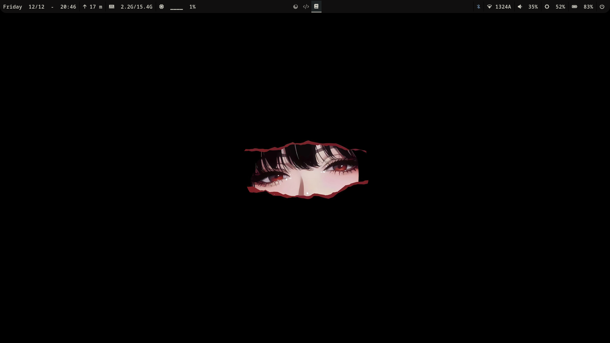
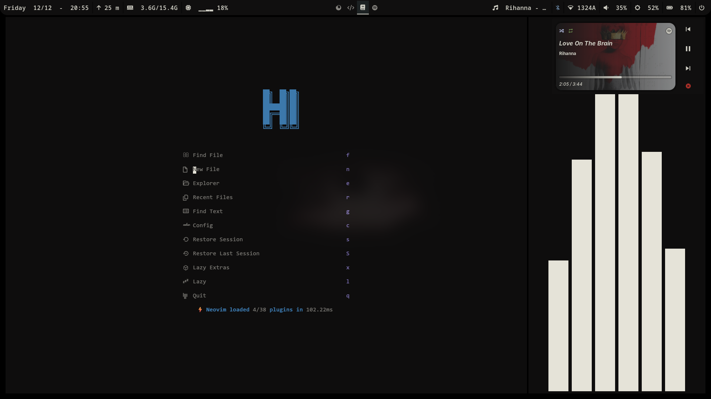
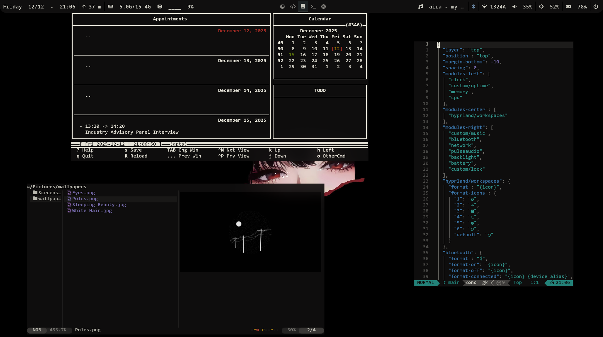
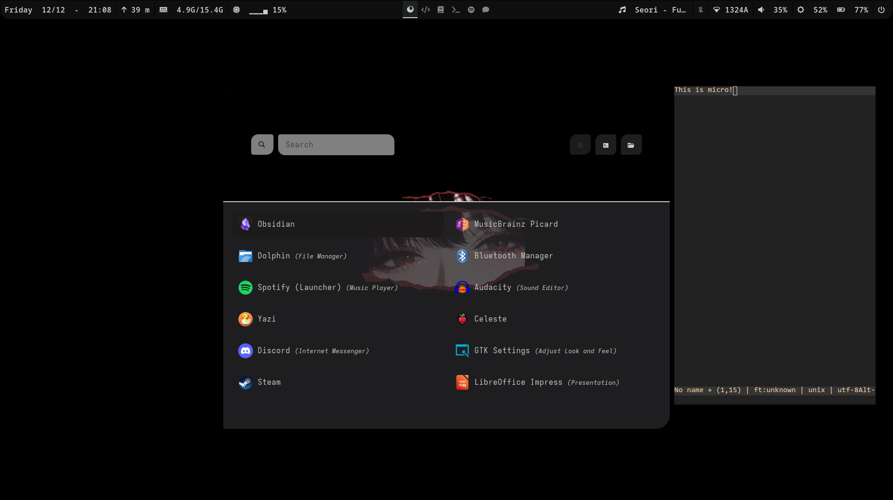
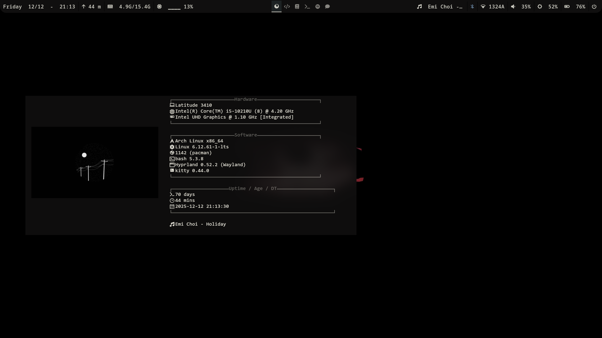
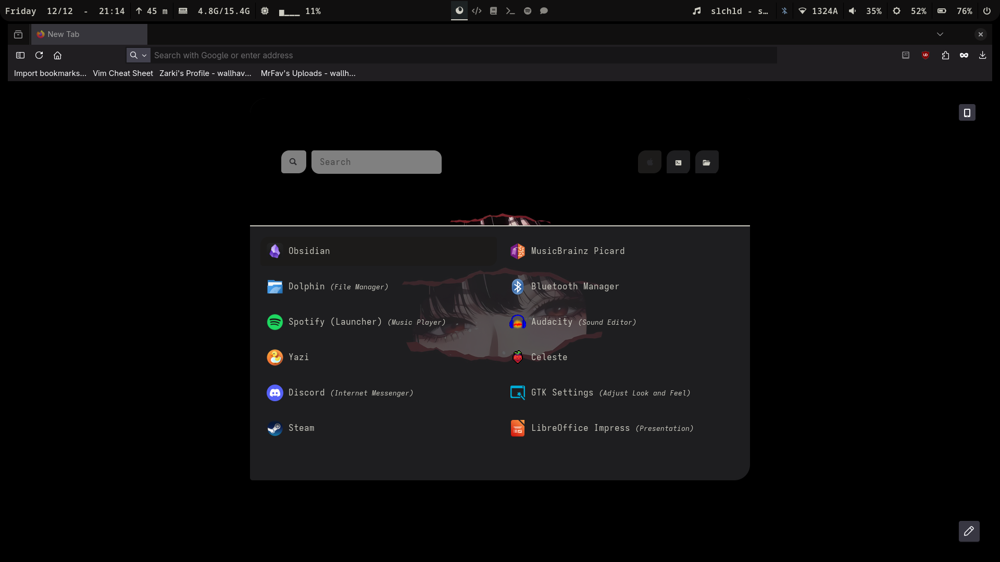

# HairyPotato's Hyperland Dotfiles

Note that this isn't plug and play; it's been heavily customised to my own preferences.

> It should be obvious that they're not very *modular*.

## Info

- OS: Arch btw
- Panel: waybar
- Menus (except notification): rofi
- Notification: mako
- Terminal: kitty
- Shell: bash
- Font: *Can't remember sorry!*
- System information: fastfetch

References/Sources:

- [Collection of Rofi Menus](https://github.com/adi1090x/rofi)
- [Flexoki Colour Scheme](https://stephango.com/flexoki)
- [Wallpaper](https://wallhaven.cc/w/oggw5p)

## Screenshots

 
 
 
